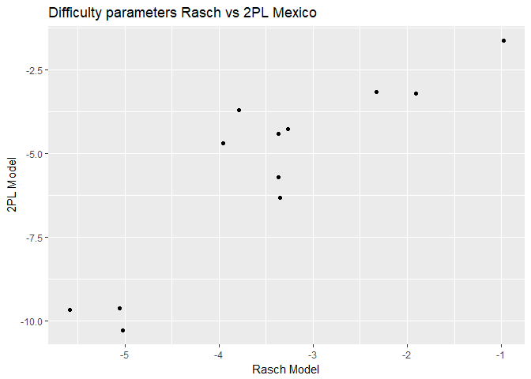
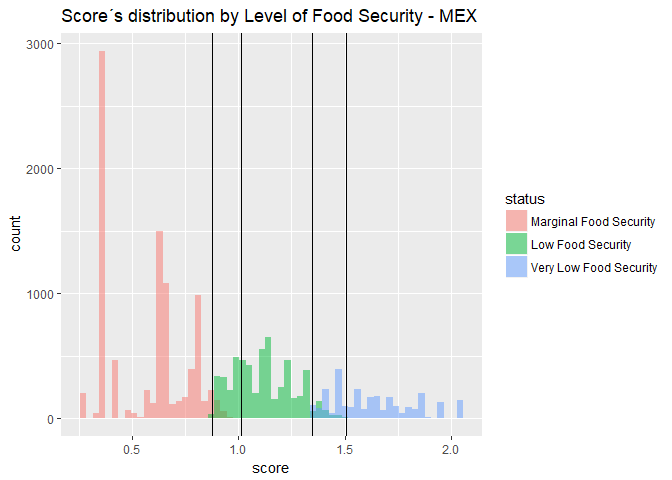
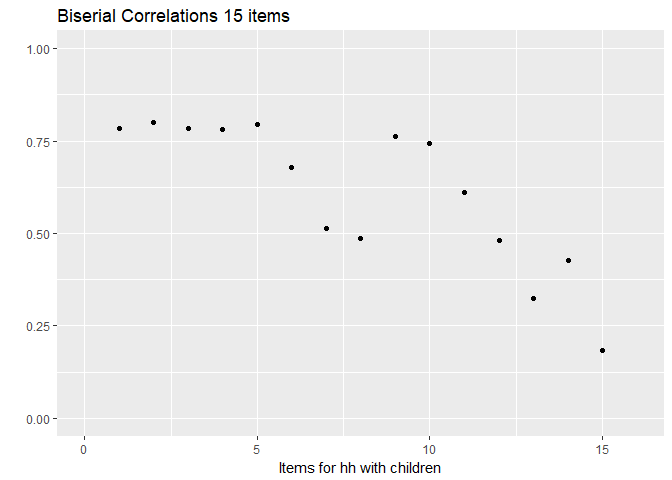

Food Security Analyisis Mexico and USA - Complete Scales
================

Step 1 - Mexico
---------------

12 items 6 for all households and 6 only for househols with children

    ## [1] 42640

    ##                                                                      
    ## 0   27275 36234 31387 37195 35938 37886 32723 35987 36068 39800 39835
    ## 1   15365  6406 11253  5445  6702  4754  9917  6653  6572  2840  2805
    ## Sum 42640 42640 42640 42640 42640 42640 42640 42640 42640 42640 42640
    ##              Sum
    ## 0   40646 430974
    ## 1    1994  80706
    ## Sum 42640 511680

    ##  [1] 0.36034240 0.15023452 0.26390713 0.12769700 0.15717636 0.11149156
    ##  [7] 0.23257505 0.15602720 0.15412758 0.06660413 0.06578330 0.04676360

    ##               Item1    Item2    Item3    Item4    Item5    Item6    Item7
    ## No         27275.00 36234.00 31387.00 37195.00 35938.00 37886.00 32723.00
    ## Yes        15365.00  6406.00 11253.00  5445.00  6702.00  4754.00  9917.00
    ## Total      42640.00 42640.00 42640.00 42640.00 42640.00 42640.00 42640.00
    ## Percentage    36.03    15.02    26.39    12.77    15.72    11.15    23.26
    ##              Item8    Item9   Item10   Item11   Item12
    ## No         35987.0 36068.00 39800.00 39835.00 40646.00
    ## Yes         6653.0  6572.00  2840.00  2805.00  1994.00
    ## Total      42640.0 42640.00 42640.00 42640.00 42640.00
    ## Percentage    15.6    15.41     6.66     6.58     4.68

    ## 
    ##  
    ##    Cell Contents
    ## |-------------------------|
    ## |                       N |
    ## |-------------------------|
    ## 
    ##  
    ## Total Observations in Table:  42640 
    ## 
    ##  
    ##              | dat$ins_ali 
    ## dat$rawscore |         0 |         1 |         2 |         3 | Row Total | 
    ## -------------|-----------|-----------|-----------|-----------|-----------|
    ##            0 |     24522 |         0 |         0 |         0 |     24522 | 
    ## -------------|-----------|-----------|-----------|-----------|-----------|
    ##            1 |         0 |      3749 |         0 |         0 |      3749 | 
    ## -------------|-----------|-----------|-----------|-----------|-----------|
    ##            2 |         0 |      3200 |         0 |         0 |      3200 | 
    ## -------------|-----------|-----------|-----------|-----------|-----------|
    ##            3 |         0 |      2084 |         0 |         0 |      2084 | 
    ## -------------|-----------|-----------|-----------|-----------|-----------|
    ##            4 |         0 |         0 |      1705 |         0 |      1705 | 
    ## -------------|-----------|-----------|-----------|-----------|-----------|
    ##            5 |         0 |         0 |      1632 |         0 |      1632 | 
    ## -------------|-----------|-----------|-----------|-----------|-----------|
    ##            6 |         0 |         0 |      1315 |         0 |      1315 | 
    ## -------------|-----------|-----------|-----------|-----------|-----------|
    ##            7 |         0 |         0 |       944 |         0 |       944 | 
    ## -------------|-----------|-----------|-----------|-----------|-----------|
    ##            8 |         0 |         0 |         0 |       783 |       783 | 
    ## -------------|-----------|-----------|-----------|-----------|-----------|
    ##            9 |         0 |         0 |         0 |       743 |       743 | 
    ## -------------|-----------|-----------|-----------|-----------|-----------|
    ##           10 |         0 |         0 |         0 |       557 |       557 | 
    ## -------------|-----------|-----------|-----------|-----------|-----------|
    ##           11 |         0 |         0 |         0 |       566 |       566 | 
    ## -------------|-----------|-----------|-----------|-----------|-----------|
    ##           12 |         0 |         0 |         0 |       840 |       840 | 
    ## -------------|-----------|-----------|-----------|-----------|-----------|
    ## Column Total |     24522 |      9033 |      5596 |      3489 |     42640 | 
    ## -------------|-----------|-----------|-----------|-----------|-----------|
    ## 
    ## 

    ## [1] 20124098

    ## [1] 42640

    ## 
    Iteration: 1, Log-Lik: -152112.032, Max-Change: 0.75043
    Iteration: 2, Log-Lik: -142444.494, Max-Change: 1.03220
    Iteration: 3, Log-Lik: -136374.776, Max-Change: 1.15659
    Iteration: 4, Log-Lik: -133426.231, Max-Change: 1.77955
    Iteration: 5, Log-Lik: -129239.959, Max-Change: 0.76214
    Iteration: 6, Log-Lik: -128710.703, Max-Change: 0.37782
    Iteration: 7, Log-Lik: -128486.664, Max-Change: 0.19473
    Iteration: 8, Log-Lik: -128373.818, Max-Change: 0.10432
    Iteration: 9, Log-Lik: -128310.992, Max-Change: 0.05989
    Iteration: 10, Log-Lik: -128272.808, Max-Change: 0.03779
    Iteration: 11, Log-Lik: -128247.676, Max-Change: 0.02625
    Iteration: 12, Log-Lik: -128230.018, Max-Change: 0.01976
    Iteration: 13, Log-Lik: -128216.960, Max-Change: 0.01571
    Iteration: 14, Log-Lik: -128206.943, Max-Change: 0.01297
    Iteration: 15, Log-Lik: -128199.041, Max-Change: 0.01082
    Iteration: 16, Log-Lik: -128192.731, Max-Change: 0.00911
    Iteration: 17, Log-Lik: -128187.631, Max-Change: 0.00771
    Iteration: 18, Log-Lik: -128183.474, Max-Change: 0.00654
    Iteration: 19, Log-Lik: -128178.662, Max-Change: 0.01947
    Iteration: 20, Log-Lik: -128170.257, Max-Change: 0.00697
    Iteration: 21, Log-Lik: -128167.256, Max-Change: 0.00359
    Iteration: 22, Log-Lik: -128165.710, Max-Change: 0.00048
    Iteration: 23, Log-Lik: -128165.519, Max-Change: 0.00044
    Iteration: 24, Log-Lik: -128165.325, Max-Change: 0.00045
    Iteration: 25, Log-Lik: -128165.123, Max-Change: 0.00338
    Iteration: 26, Log-Lik: -128163.674, Max-Change: 0.00019
    Iteration: 27, Log-Lik: -128163.637, Max-Change: 0.00018
    Iteration: 28, Log-Lik: -128163.562, Max-Change: 0.00015
    Iteration: 29, Log-Lik: -128163.500, Max-Change: 0.00010
    Iteration: 30, Log-Lik: -128163.455, Max-Change: 0.00009

    ## $items
    ##        a1      d g u
    ## Item1   1 -0.978 0 1
    ## Item2   1 -3.366 0 1
    ## Item3   1 -1.910 0 1
    ## Item4   1 -3.785 0 1
    ## Item5   1 -3.267 0 1
    ## Item6   1 -3.956 0 1
    ## Item7   1 -2.327 0 1
    ## Item8   1 -3.355 0 1
    ## Item9   1 -3.372 0 1
    ## Item10  1 -5.060 0 1
    ## Item11  1 -5.024 0 1
    ## Item12  1 -5.584 0 1
    ## 
    ## $means
    ## F1 
    ##  0 
    ## 
    ## $cov
    ##     F1
    ## F1 7.4

    ## 
    Iteration: 1, Log-Lik: -157644.583, Max-Change: 2.85156
    Iteration: 2, Log-Lik: -137410.705, Max-Change: 2.04441
    Iteration: 3, Log-Lik: -128637.953, Max-Change: 2.34305
    Iteration: 4, Log-Lik: -126362.448, Max-Change: 0.84998
    Iteration: 5, Log-Lik: -125308.993, Max-Change: 0.74236
    Iteration: 6, Log-Lik: -124798.500, Max-Change: 0.40282
    Iteration: 7, Log-Lik: -124503.187, Max-Change: 0.33570
    Iteration: 8, Log-Lik: -124327.734, Max-Change: 0.23980
    Iteration: 9, Log-Lik: -124220.098, Max-Change: 0.15819
    Iteration: 10, Log-Lik: -124160.565, Max-Change: 0.13124
    Iteration: 11, Log-Lik: -124119.642, Max-Change: 0.09491
    Iteration: 12, Log-Lik: -124092.093, Max-Change: 0.09784
    Iteration: 13, Log-Lik: -124072.106, Max-Change: 0.07209
    Iteration: 14, Log-Lik: -124057.337, Max-Change: 0.05931
    Iteration: 15, Log-Lik: -124045.625, Max-Change: 0.04464
    Iteration: 16, Log-Lik: -124036.089, Max-Change: 0.02375
    Iteration: 17, Log-Lik: -124029.746, Max-Change: 0.01770
    Iteration: 18, Log-Lik: -124024.597, Max-Change: 0.01608
    Iteration: 19, Log-Lik: -124020.101, Max-Change: 0.01578
    Iteration: 20, Log-Lik: -124016.443, Max-Change: 0.03242
    Iteration: 21, Log-Lik: -124011.644, Max-Change: 0.01211
    Iteration: 22, Log-Lik: -124008.752, Max-Change: 0.00977
    Iteration: 23, Log-Lik: -124006.097, Max-Change: 0.00961
    Iteration: 24, Log-Lik: -124003.772, Max-Change: 0.00865
    Iteration: 25, Log-Lik: -123993.091, Max-Change: 0.00550
    Iteration: 26, Log-Lik: -123992.153, Max-Change: 0.00543
    Iteration: 27, Log-Lik: -123991.348, Max-Change: 0.00479
    Iteration: 28, Log-Lik: -123988.824, Max-Change: 0.00456
    Iteration: 29, Log-Lik: -123988.320, Max-Change: 0.00363
    Iteration: 30, Log-Lik: -123987.856, Max-Change: 0.00342
    Iteration: 31, Log-Lik: -123986.217, Max-Change: 0.00322
    Iteration: 32, Log-Lik: -123985.992, Max-Change: 0.00226
    Iteration: 33, Log-Lik: -123985.800, Max-Change: 0.00208
    Iteration: 34, Log-Lik: -123984.888, Max-Change: 0.00155
    Iteration: 35, Log-Lik: -123984.795, Max-Change: 0.00158
    Iteration: 36, Log-Lik: -123984.714, Max-Change: 0.00154
    Iteration: 37, Log-Lik: -123984.334, Max-Change: 0.00152
    Iteration: 38, Log-Lik: -123984.296, Max-Change: 0.00090
    Iteration: 39, Log-Lik: -123984.275, Max-Change: 0.00104
    Iteration: 40, Log-Lik: -123984.214, Max-Change: 0.00086
    Iteration: 41, Log-Lik: -123984.198, Max-Change: 0.00084
    Iteration: 42, Log-Lik: -123984.174, Max-Change: 0.00082
    Iteration: 43, Log-Lik: -123984.068, Max-Change: 0.00064
    Iteration: 44, Log-Lik: -123984.060, Max-Change: 0.00056
    Iteration: 45, Log-Lik: -123984.053, Max-Change: 0.00054
    Iteration: 46, Log-Lik: -123984.023, Max-Change: 0.00022
    Iteration: 47, Log-Lik: -123984.020, Max-Change: 0.00025
    Iteration: 48, Log-Lik: -123984.019, Max-Change: 0.00024
    Iteration: 49, Log-Lik: -123984.015, Max-Change: 0.00026
    Iteration: 50, Log-Lik: -123984.014, Max-Change: 0.00033
    Iteration: 51, Log-Lik: -123984.013, Max-Change: 0.00023
    Iteration: 52, Log-Lik: -123984.012, Max-Change: 0.00022
    Iteration: 53, Log-Lik: -123984.011, Max-Change: 0.00021
    Iteration: 54, Log-Lik: -123984.010, Max-Change: 0.00020
    Iteration: 55, Log-Lik: -123984.009, Max-Change: 0.00020
    Iteration: 56, Log-Lik: -123984.009, Max-Change: 0.00021
    Iteration: 57, Log-Lik: -123984.008, Max-Change: 0.00019
    Iteration: 58, Log-Lik: -123984.008, Max-Change: 0.00018
    Iteration: 59, Log-Lik: -123984.007, Max-Change: 0.00018
    Iteration: 60, Log-Lik: -123984.007, Max-Change: 0.00017
    Iteration: 61, Log-Lik: -123984.006, Max-Change: 0.00017
    Iteration: 62, Log-Lik: -123984.006, Max-Change: 0.00016
    Iteration: 63, Log-Lik: -123984.006, Max-Change: 0.00017
    Iteration: 64, Log-Lik: -123984.005, Max-Change: 0.00016
    Iteration: 65, Log-Lik: -123984.005, Max-Change: 0.00016
    Iteration: 66, Log-Lik: -123984.005, Max-Change: 0.00015
    Iteration: 67, Log-Lik: -123984.005, Max-Change: 0.00015
    Iteration: 68, Log-Lik: -123984.004, Max-Change: 0.00015
    Iteration: 69, Log-Lik: -123984.004, Max-Change: 0.00015
    Iteration: 70, Log-Lik: -123984.004, Max-Change: 0.00014
    Iteration: 71, Log-Lik: -123984.004, Max-Change: 0.00014
    Iteration: 72, Log-Lik: -123984.004, Max-Change: 0.00014
    Iteration: 73, Log-Lik: -123984.003, Max-Change: 0.00014
    Iteration: 74, Log-Lik: -123984.003, Max-Change: 0.00013
    Iteration: 75, Log-Lik: -123984.003, Max-Change: 0.00014
    Iteration: 76, Log-Lik: -123984.003, Max-Change: 0.00013
    Iteration: 77, Log-Lik: -123984.003, Max-Change: 0.00013
    Iteration: 78, Log-Lik: -123984.003, Max-Change: 0.00013
    Iteration: 79, Log-Lik: -123984.003, Max-Change: 0.00013
    Iteration: 80, Log-Lik: -123984.002, Max-Change: 0.00013
    Iteration: 81, Log-Lik: -123984.002, Max-Change: 0.00013
    Iteration: 82, Log-Lik: -123984.002, Max-Change: 0.00012
    Iteration: 83, Log-Lik: -123984.002, Max-Change: 0.00012
    Iteration: 84, Log-Lik: -123984.002, Max-Change: 0.00012
    Iteration: 85, Log-Lik: -123984.002, Max-Change: 0.00012
    Iteration: 86, Log-Lik: -123984.002, Max-Change: 0.00012
    Iteration: 87, Log-Lik: -123984.002, Max-Change: 0.00060
    Iteration: 88, Log-Lik: -123984.001, Max-Change: 0.00055
    Iteration: 89, Log-Lik: -123984.001, Max-Change: 0.00048
    Iteration: 90, Log-Lik: -123984.001, Max-Change: 0.00043
    Iteration: 91, Log-Lik: -123984.001, Max-Change: 0.00055
    Iteration: 92, Log-Lik: -123984.000, Max-Change: 0.00028
    Iteration: 93, Log-Lik: -123984.000, Max-Change: 0.00025
    Iteration: 94, Log-Lik: -123984.000, Max-Change: 0.00862
    Iteration: 95, Log-Lik: -123983.995, Max-Change: 0.00038
    Iteration: 96, Log-Lik: -123983.994, Max-Change: 0.00035
    Iteration: 97, Log-Lik: -123983.994, Max-Change: 0.00006

    ## $items
    ##           a1       d g u
    ## Item1  3.730  -1.634 0 1
    ## Item2  3.775  -4.404 0 1
    ## Item3  4.477  -3.220 0 1
    ## Item4  2.662  -3.717 0 1
    ## Item5  3.746  -4.267 0 1
    ## Item6  3.445  -4.696 0 1
    ## Item7  3.681  -3.175 0 1
    ## Item8  5.698  -6.322 0 1
    ## Item9  5.068  -5.705 0 1
    ## Item10 6.163  -9.621 0 1
    ## Item11 6.672 -10.273 0 1
    ## Item12 5.570  -9.658 0 1
    ## 
    ## $means
    ## F1 
    ##  0 
    ## 
    ## $cov
    ##    F1
    ## F1  1

    ## 
    ## Model 1: mirt(data = items, model = 1, itemtype = "Rasch", survey.weights = dat$weight.model)
    ## Model 2: mirt(data = items, model = 1, itemtype = "2PL", survey.weights = dat$weight.model)

    ##        AIC     AICc    SABIC      BIC    logLik       X2  df   p
    ## 1 256352.9 256352.9 256424.2 256465.5 -128163.5      NaN NaN NaN
    ## 2 248016.0 248016.0 248147.6 248223.8 -123984.0 8358.922  11   0

    ##      difpar.r   nam1
    ## 12 -5.5842187 Item12
    ## 10 -5.0601456 Item10
    ## 11 -5.0236646 Item11
    ## 6  -3.9559369  Item6
    ## 4  -3.7848503  Item4
    ## 9  -3.3724805  Item9
    ## 2  -3.3663562  Item2
    ## 8  -3.3545375  Item8
    ## 5  -3.2668051  Item5
    ## 7  -2.3268360  Item7
    ## 3  -1.9097985  Item3
    ## 1  -0.9780848  Item1

    ##      difpar.2   nam1
    ## 11 -10.273022 Item11
    ## 12  -9.658433 Item12
    ## 10  -9.620999 Item10
    ## 8   -6.322017  Item8
    ## 9   -5.704816  Item9
    ## 6   -4.695596  Item6
    ## 2   -4.404397  Item2
    ## 5   -4.266501  Item5
    ## 4   -3.717029  Item4
    ## 3   -3.219711  Item3
    ## 7   -3.175032  Item7
    ## 1   -1.633837  Item1

    ##    discpar.2   nam1
    ## 4   2.661574  Item4
    ## 6   3.444545  Item6
    ## 7   3.681339  Item7
    ## 1   3.729824  Item1
    ## 5   3.745922  Item5
    ## 2   3.775180  Item2
    ## 3   4.477397  Item3
    ## 9   5.067985  Item9
    ## 12  5.569753 Item12
    ## 8   5.697924  Item8
    ## 10  6.163069 Item10
    ## 11  6.672330 Item11

    ##    Min. 1st Qu.  Median    Mean 3rd Qu.    Max. 
    ##  0.2553  0.3664  0.6168  0.5684  0.6868  1.0128

    ##    Min. 1st Qu.  Median    Mean 3rd Qu.    Max. 
    ##  0.8745  1.0053  1.1222  1.1195  1.2188  1.5075

    ##    Min. 1st Qu.  Median    Mean 3rd Qu.    Max. 
    ##   1.345   1.495   1.705     Inf   2.026     Inf

### Step 2 - United States

15 items, 8 for all households, 7 just for househols with children

    ## [1] 48200

    ##                                                                      
    ## 0   38012 40435 41101 44270 43993 46105 47151 47426 41830 44137 46488
    ## 1   10188  7765  7099  3930  4207  2095  1049   774  6370  4063  1712
    ## Sum 48200 48200 48200 48200 48200 48200 48200 48200 48200 48200 48200
    ##                                Sum
    ## 0   47414 47949 47725 48147 672183
    ## 1     786   251   475    53  50817
    ## Sum 48200 48200 48200 48200 723000

    ##               Item2    Item3    Item4    Item8    Item9   Item10   Item11
    ## No         38012.00 40435.00 41101.00 44270.00 43993.00 46105.00 47151.00
    ## Yes        10188.00  7765.00  7099.00  3930.00  4207.00  2095.00  1049.00
    ## Total      48200.00 48200.00 48200.00 48200.00 48200.00 48200.00 48200.00
    ## Percentage    21.14    16.11    14.73     8.15     8.73     4.35     2.18
    ##              Item12    Item5    Item6    Item7   Item13   Item14   Item15
    ## No         47426.00 41830.00 44137.00 46488.00 47414.00 47949.00 47725.00
    ## Yes          774.00  6370.00  4063.00  1712.00   786.00   251.00   475.00
    ## Total      48200.00 48200.00 48200.00 48200.00 48200.00 48200.00 48200.00
    ## Percentage     1.61    13.22     8.43     3.55     1.63     0.52     0.99
    ##              Item16
    ## No         48147.00
    ## Yes           53.00
    ## Total      48200.00
    ## Percentage     0.11

    ## 
    ##  
    ##    Cell Contents
    ## |-------------------------|
    ## |                       N |
    ## |-------------------------|
    ## 
    ##  
    ## Total Observations in Table:  48200 
    ## 
    ##  
    ##              | dat$status 
    ## dat$rawscore |     High Food Security | Marginal Food Security |      Low Food Security | Very Low Food Security |              Row Total | 
    ## -------------|------------------------|------------------------|------------------------|------------------------|------------------------|
    ##            0 |                  35514 |                      0 |                      0 |                      0 |                  35514 | 
    ## -------------|------------------------|------------------------|------------------------|------------------------|------------------------|
    ##            1 |                      0 |                   3000 |                      0 |                      0 |                   3000 | 
    ## -------------|------------------------|------------------------|------------------------|------------------------|------------------------|
    ##            2 |                      0 |                   2023 |                      0 |                      0 |                   2023 | 
    ## -------------|------------------------|------------------------|------------------------|------------------------|------------------------|
    ##            3 |                      0 |                      0 |                   1707 |                      0 |                   1707 | 
    ## -------------|------------------------|------------------------|------------------------|------------------------|------------------------|
    ##            4 |                      0 |                      0 |                   1212 |                      0 |                   1212 | 
    ## -------------|------------------------|------------------------|------------------------|------------------------|------------------------|
    ##            5 |                      0 |                      0 |                   1023 |                      0 |                   1023 | 
    ## -------------|------------------------|------------------------|------------------------|------------------------|------------------------|
    ##            6 |                      0 |                      0 |                    881 |                      0 |                    881 | 
    ## -------------|------------------------|------------------------|------------------------|------------------------|------------------------|
    ##            7 |                      0 |                      0 |                    595 |                      0 |                    595 | 
    ## -------------|------------------------|------------------------|------------------------|------------------------|------------------------|
    ##            8 |                      0 |                      0 |                      0 |                    631 |                    631 | 
    ## -------------|------------------------|------------------------|------------------------|------------------------|------------------------|
    ##            9 |                      0 |                      0 |                      0 |                    444 |                    444 | 
    ## -------------|------------------------|------------------------|------------------------|------------------------|------------------------|
    ##           10 |                      0 |                      0 |                      0 |                    378 |                    378 | 
    ## -------------|------------------------|------------------------|------------------------|------------------------|------------------------|
    ##           11 |                      0 |                      0 |                      0 |                    240 |                    240 | 
    ## -------------|------------------------|------------------------|------------------------|------------------------|------------------------|
    ##           12 |                      0 |                      0 |                      0 |                    186 |                    186 | 
    ## -------------|------------------------|------------------------|------------------------|------------------------|------------------------|
    ##           13 |                      0 |                      0 |                      0 |                    122 |                    122 | 
    ## -------------|------------------------|------------------------|------------------------|------------------------|------------------------|
    ##           14 |                      0 |                      0 |                      0 |                    116 |                    116 | 
    ## -------------|------------------------|------------------------|------------------------|------------------------|------------------------|
    ##           15 |                      0 |                      0 |                      0 |                     75 |                     75 | 
    ## -------------|------------------------|------------------------|------------------------|------------------------|------------------------|
    ##           16 |                      0 |                      0 |                      0 |                      7 |                      7 | 
    ## -------------|------------------------|------------------------|------------------------|------------------------|------------------------|
    ##           17 |                      0 |                      0 |                      0 |                     23 |                     23 | 
    ## -------------|------------------------|------------------------|------------------------|------------------------|------------------------|
    ##           18 |                      0 |                      0 |                      0 |                     23 |                     23 | 
    ## -------------|------------------------|------------------------|------------------------|------------------------|------------------------|
    ## Column Total |                  35514 |                   5023 |                   5418 |                   2245 |                  48200 | 
    ## -------------|------------------------|------------------------|------------------------|------------------------|------------------------|
    ## 
    ## 

    ## [1] 154093158

    ## [1] 48200

    ## 
    Iteration: 1, Log-Lik: -119358.275, Max-Change: 1.52014
    Iteration: 2, Log-Lik: -112041.187, Max-Change: 0.70067
    Iteration: 3, Log-Lik: -107078.460, Max-Change: 0.79868
    Iteration: 4, Log-Lik: -103687.790, Max-Change: 1.44334
    Iteration: 5, Log-Lik: -99500.242, Max-Change: 0.89134
    Iteration: 6, Log-Lik: -98604.555, Max-Change: 0.55158
    Iteration: 7, Log-Lik: -98200.567, Max-Change: 0.32905
    Iteration: 8, Log-Lik: -97988.196, Max-Change: 0.19457
    Iteration: 9, Log-Lik: -97867.266, Max-Change: 0.11826
    Iteration: 10, Log-Lik: -97794.201, Max-Change: 0.07526
    Iteration: 11, Log-Lik: -97748.050, Max-Change: 0.05084
    Iteration: 12, Log-Lik: -97717.405, Max-Change: 0.03666
    Iteration: 13, Log-Lik: -97696.057, Max-Change: 0.02700
    Iteration: 14, Log-Lik: -97680.888, Max-Change: 0.02087
    Iteration: 15, Log-Lik: -97669.653, Max-Change: 0.01575
    Iteration: 16, Log-Lik: -97661.443, Max-Change: 0.01259
    Iteration: 17, Log-Lik: -97655.110, Max-Change: 0.00992
    Iteration: 18, Log-Lik: -97650.250, Max-Change: 0.00781
    Iteration: 19, Log-Lik: -97646.502, Max-Change: 0.00616
    Iteration: 20, Log-Lik: -97643.601, Max-Change: 0.00486
    Iteration: 21, Log-Lik: -97641.344, Max-Change: 0.00387
    Iteration: 22, Log-Lik: -97639.457, Max-Change: 0.00674
    Iteration: 23, Log-Lik: -97636.483, Max-Change: 0.00300
    Iteration: 24, Log-Lik: -97635.163, Max-Change: 0.00054
    Iteration: 25, Log-Lik: -97634.926, Max-Change: 0.00044
    Iteration: 26, Log-Lik: -97634.731, Max-Change: 0.00024
    Iteration: 27, Log-Lik: -97634.625, Max-Change: 0.00033
    Iteration: 28, Log-Lik: -97634.478, Max-Change: 0.00032
    Iteration: 29, Log-Lik: -97634.337, Max-Change: 0.00024
    Iteration: 30, Log-Lik: -97634.238, Max-Change: 0.00025
    Iteration: 31, Log-Lik: -97634.127, Max-Change: 0.00030
    Iteration: 32, Log-Lik: -97633.994, Max-Change: 0.00018
    Iteration: 33, Log-Lik: -97633.941, Max-Change: 0.00020
    Iteration: 34, Log-Lik: -97633.854, Max-Change: 0.00013
    Iteration: 35, Log-Lik: -97633.803, Max-Change: 0.00011
    Iteration: 36, Log-Lik: -97633.755, Max-Change: 0.00011
    Iteration: 37, Log-Lik: -97633.717, Max-Change: 0.00023
    Iteration: 38, Log-Lik: -97633.615, Max-Change: 0.00009

    ## $items
    ##        a1      d g u
    ## Item2   1 -2.257 0 1
    ## Item3   1 -2.943 0 1
    ## Item4   1 -3.244 0 1
    ## Item8   1 -4.440 0 1
    ## Item9   1 -4.344 0 1
    ## Item10  1 -5.557 0 1
    ## Item11  1 -6.500 0 1
    ## Item12  1 -6.780 0 1
    ## Item5   1 -3.541 0 1
    ## Item6   1 -4.422 0 1
    ## Item7   1 -5.774 0 1
    ## Item13  1 -6.773 0 1
    ## Item14  1 -7.913 0 1
    ## Item15  1 -7.350 0 1
    ## Item16  1 -9.549 0 1
    ## 
    ## $means
    ## F1 
    ##  0 
    ## 
    ## $cov
    ##       F1
    ## F1 6.825

    ## 
    Iteration: 1, Log-Lik: -123711.770, Max-Change: 2.91014
    Iteration: 2, Log-Lik: -108860.152, Max-Change: 1.67681
    Iteration: 3, Log-Lik: -102569.562, Max-Change: 1.34064
    Iteration: 4, Log-Lik: -98939.262, Max-Change: 1.11925
    Iteration: 5, Log-Lik: -95747.999, Max-Change: 1.09637
    Iteration: 6, Log-Lik: -94208.617, Max-Change: 0.92451
    Iteration: 7, Log-Lik: -93392.591, Max-Change: 0.54940
    Iteration: 8, Log-Lik: -92981.741, Max-Change: 0.51960
    Iteration: 9, Log-Lik: -92795.772, Max-Change: 0.38118
    Iteration: 10, Log-Lik: -92682.375, Max-Change: 0.52679
    Iteration: 11, Log-Lik: -92507.660, Max-Change: 0.15529
    Iteration: 12, Log-Lik: -92390.910, Max-Change: 0.22313
    Iteration: 13, Log-Lik: -92304.352, Max-Change: 0.51048
    Iteration: 14, Log-Lik: -92245.744, Max-Change: 0.60917
    Iteration: 15, Log-Lik: -92195.732, Max-Change: 0.13812
    Iteration: 16, Log-Lik: -92159.220, Max-Change: 0.17495
    Iteration: 17, Log-Lik: -92128.720, Max-Change: 0.48192
    Iteration: 18, Log-Lik: -92104.800, Max-Change: 0.11652
    Iteration: 19, Log-Lik: -92084.170, Max-Change: 0.23502
    Iteration: 20, Log-Lik: -92067.194, Max-Change: 0.06310
    Iteration: 21, Log-Lik: -92052.736, Max-Change: 0.20385
    Iteration: 22, Log-Lik: -92040.771, Max-Change: 0.20321
    Iteration: 23, Log-Lik: -92030.715, Max-Change: 0.09372
    Iteration: 24, Log-Lik: -92022.106, Max-Change: 0.21269
    Iteration: 25, Log-Lik: -92014.957, Max-Change: 0.06321
    Iteration: 26, Log-Lik: -92008.788, Max-Change: 0.07346
    Iteration: 27, Log-Lik: -92003.525, Max-Change: 0.14628
    Iteration: 28, Log-Lik: -91999.110, Max-Change: 0.08254
    Iteration: 29, Log-Lik: -91995.285, Max-Change: 0.07280
    Iteration: 30, Log-Lik: -91991.985, Max-Change: 0.09319
    Iteration: 31, Log-Lik: -91987.771, Max-Change: 0.04547
    Iteration: 32, Log-Lik: -91985.540, Max-Change: 0.01976
    Iteration: 33, Log-Lik: -91983.965, Max-Change: 0.16267
    Iteration: 34, Log-Lik: -91982.225, Max-Change: 0.02871
    Iteration: 35, Log-Lik: -91980.764, Max-Change: 0.01238
    Iteration: 36, Log-Lik: -91979.778, Max-Change: 0.00768
    Iteration: 37, Log-Lik: -91977.352, Max-Change: 0.00946
    Iteration: 38, Log-Lik: -91976.724, Max-Change: 0.00464
    Iteration: 39, Log-Lik: -91976.197, Max-Change: 0.00637
    Iteration: 40, Log-Lik: -91973.700, Max-Change: 0.00298
    Iteration: 41, Log-Lik: -91973.471, Max-Change: 0.00240
    Iteration: 42, Log-Lik: -91973.290, Max-Change: 0.00202
    Iteration: 43, Log-Lik: -91972.672, Max-Change: 0.00785
    Iteration: 44, Log-Lik: -91972.550, Max-Change: 0.00160
    Iteration: 45, Log-Lik: -91972.460, Max-Change: 0.00175
    Iteration: 46, Log-Lik: -91972.142, Max-Change: 0.00466
    Iteration: 47, Log-Lik: -91972.078, Max-Change: 0.00131
    Iteration: 48, Log-Lik: -91972.027, Max-Change: 0.00136
    Iteration: 49, Log-Lik: -91971.791, Max-Change: 0.00099
    Iteration: 50, Log-Lik: -91971.769, Max-Change: 0.00259
    Iteration: 51, Log-Lik: -91971.755, Max-Change: 0.00105
    Iteration: 52, Log-Lik: -91971.738, Max-Change: 0.00134
    Iteration: 53, Log-Lik: -91971.722, Max-Change: 0.00081
    Iteration: 54, Log-Lik: -91971.708, Max-Change: 0.00071
    Iteration: 55, Log-Lik: -91971.668, Max-Change: 0.00064
    Iteration: 56, Log-Lik: -91971.660, Max-Change: 0.00063
    Iteration: 57, Log-Lik: -91971.651, Max-Change: 0.00064
    Iteration: 58, Log-Lik: -91971.616, Max-Change: 0.00176
    Iteration: 59, Log-Lik: -91971.610, Max-Change: 0.00066
    Iteration: 60, Log-Lik: -91971.608, Max-Change: 0.00087
    Iteration: 61, Log-Lik: -91971.606, Max-Change: 0.00046
    Iteration: 62, Log-Lik: -91971.603, Max-Change: 0.00024
    Iteration: 63, Log-Lik: -91971.601, Max-Change: 0.00023
    Iteration: 64, Log-Lik: -91971.599, Max-Change: 0.00022
    Iteration: 65, Log-Lik: -91971.598, Max-Change: 0.00020
    Iteration: 66, Log-Lik: -91971.597, Max-Change: 0.00020
    Iteration: 67, Log-Lik: -91971.596, Max-Change: 0.00020
    Iteration: 68, Log-Lik: -91971.595, Max-Change: 0.00020
    Iteration: 69, Log-Lik: -91971.594, Max-Change: 0.00019
    Iteration: 70, Log-Lik: -91971.593, Max-Change: 0.00021
    Iteration: 71, Log-Lik: -91971.593, Max-Change: 0.00019
    Iteration: 72, Log-Lik: -91971.592, Max-Change: 0.00019
    Iteration: 73, Log-Lik: -91971.591, Max-Change: 0.00018
    Iteration: 74, Log-Lik: -91971.591, Max-Change: 0.00018
    Iteration: 75, Log-Lik: -91971.590, Max-Change: 0.00018
    Iteration: 76, Log-Lik: -91971.590, Max-Change: 0.00018
    Iteration: 77, Log-Lik: -91971.590, Max-Change: 0.00017
    Iteration: 78, Log-Lik: -91971.589, Max-Change: 0.00017
    Iteration: 79, Log-Lik: -91971.589, Max-Change: 0.00017
    Iteration: 80, Log-Lik: -91971.588, Max-Change: 0.00016
    Iteration: 81, Log-Lik: -91971.588, Max-Change: 0.00016
    Iteration: 82, Log-Lik: -91971.588, Max-Change: 0.00016
    Iteration: 83, Log-Lik: -91971.587, Max-Change: 0.00016
    Iteration: 84, Log-Lik: -91971.587, Max-Change: 0.00015
    Iteration: 85, Log-Lik: -91971.587, Max-Change: 0.00015
    Iteration: 86, Log-Lik: -91971.587, Max-Change: 0.00015
    Iteration: 87, Log-Lik: -91971.586, Max-Change: 0.00072
    Iteration: 88, Log-Lik: -91971.586, Max-Change: 0.00073
    Iteration: 89, Log-Lik: -91971.585, Max-Change: 0.00056
    Iteration: 90, Log-Lik: -91971.585, Max-Change: 0.00051
    Iteration: 91, Log-Lik: -91971.585, Max-Change: 0.00070
    Iteration: 92, Log-Lik: -91971.584, Max-Change: 0.00043
    Iteration: 93, Log-Lik: -91971.584, Max-Change: 0.00040
    Iteration: 94, Log-Lik: -91971.583, Max-Change: 0.00072
    Iteration: 95, Log-Lik: -91971.583, Max-Change: 0.00026
    Iteration: 96, Log-Lik: -91971.582, Max-Change: 0.00025
    Iteration: 97, Log-Lik: -91971.582, Max-Change: 0.86146
    Iteration: 98, Log-Lik: -91971.252, Max-Change: 0.00622
    Iteration: 99, Log-Lik: -91971.242, Max-Change: 0.00020
    Iteration: 100, Log-Lik: -91971.242, Max-Change: 0.00020
    Iteration: 101, Log-Lik: -91971.241, Max-Change: 0.00020
    Iteration: 102, Log-Lik: -91971.241, Max-Change: 0.00019
    Iteration: 103, Log-Lik: -91971.241, Max-Change: 0.00091
    Iteration: 104, Log-Lik: -91971.240, Max-Change: 0.00034
    Iteration: 105, Log-Lik: -91971.240, Max-Change: 0.00033
    Iteration: 106, Log-Lik: -91971.240, Max-Change: 0.00065
    Iteration: 107, Log-Lik: -91971.240, Max-Change: 0.00034
    Iteration: 108, Log-Lik: -91971.240, Max-Change: 0.00030
    Iteration: 109, Log-Lik: -91971.239, Max-Change: 0.00009

    ## $items
    ##           a1       d g u
    ## Item2  6.056  -5.166 0 1
    ## Item3  5.354  -5.735 0 1
    ## Item4  3.982  -4.758 0 1
    ## Item8  5.948  -8.827 0 1
    ## Item9  5.999  -8.741 0 1
    ## Item10 5.407  -9.773 0 1
    ## Item11 3.928  -8.592 0 1
    ## Item12 4.794 -10.533 0 1
    ## Item5  3.546  -4.634 0 1
    ## Item6  3.811  -5.926 0 1
    ## Item7  3.820  -7.518 0 1
    ## Item13 4.533 -10.039 0 1
    ## Item14 4.881 -12.339 0 1
    ## Item15 5.220 -12.201 0 1
    ## Item16 6.323 -18.274 0 1
    ## 
    ## $means
    ## F1 
    ##  0 
    ## 
    ## $cov
    ##    F1
    ## F1  1

    ## 
    ## Model 1: mirt(data = items, model = 1, itemtype = "Rasch", survey.weights = dat$weight.model)
    ## Model 2: mirt(data = items, model = 1, itemtype = "2PL", survey.weights = dat$weight.model)

    ##        AIC     AICc    SABIC      BIC    logLik       X2  df   p
    ## 1 195299.2 195299.2 195388.9 195439.8 -97633.62      NaN NaN NaN
    ## 2 184002.5 184002.5 184170.6 184266.0 -91971.24 11324.75  14   0

    ##     difpar.r   nam1
    ## 15 -9.548678 Item16
    ## 13 -7.913043 Item14
    ## 14 -7.349961 Item15
    ## 8  -6.779539 Item12
    ## 12 -6.772899 Item13
    ## 7  -6.500238 Item11
    ## 11 -5.774313  Item7
    ## 6  -5.556953 Item10
    ## 4  -4.439961  Item8
    ## 10 -4.421904  Item6
    ## 5  -4.344076  Item9
    ## 9  -3.541455  Item5
    ## 3  -3.243966  Item4
    ## 2  -2.943163  Item3
    ## 1  -2.257199  Item2

    ##      difpar.2   nam1
    ## 15 -18.273823 Item16
    ## 13 -12.339247 Item14
    ## 14 -12.200908 Item15
    ## 8  -10.532829 Item12
    ## 12 -10.039135 Item13
    ## 6   -9.773148 Item10
    ## 4   -8.826858  Item8
    ## 5   -8.740720  Item9
    ## 7   -8.591863 Item11
    ## 11  -7.517804  Item7
    ## 10  -5.926300  Item6
    ## 2   -5.735187  Item3
    ## 1   -5.166443  Item2
    ## 3   -4.758379  Item4
    ## 9   -4.634479  Item5

    ##    discpar.2   nam1
    ## 9   3.546437  Item5
    ## 10  3.811459  Item6
    ## 11  3.819839  Item7
    ## 7   3.927519 Item11
    ## 3   3.982435  Item4
    ## 12  4.532928 Item13
    ## 8   4.794363 Item12
    ## 13  4.881420 Item14
    ## 14  5.219825 Item15
    ## 2   5.353694  Item3
    ## 6   5.406714 Item10
    ## 4   5.947733  Item8
    ## 5   5.998778  Item9
    ## 1   6.055518  Item2
    ## 15  6.323328 Item16

    ##    Min. 1st Qu.  Median    Mean 3rd Qu.    Max. 
    ##  0.7003  0.8045  0.8387  0.8767  1.0036  1.0768

    ##    Min. 1st Qu.  Median    Mean 3rd Qu.    Max. 
    ##  0.9996  1.1885  1.3527  1.3581  1.5012  1.7994

    ##    Min. 1st Qu.  Median    Mean 3rd Qu.    Max. 
    ##   1.629   1.807   1.948     Inf   2.141     Inf

