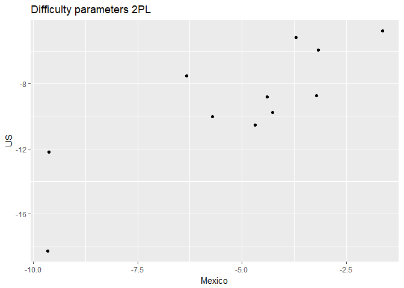
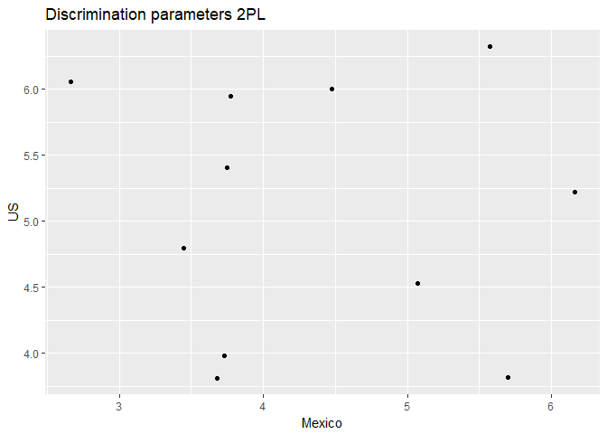

Food Security Analyisis Mexico and USA - Reduced Scales
================

#### Prepare data

Difficulty parameters
=====================

Ordered by difficulty of the Mexican scale items

``` r
pars1[c(1,2,5,6)]
```

    ##    difficulty.mex difficulty.us namesmex namesus
    ## 12      -9.658433    -18.273823   Item12  Item16
    ## 10      -9.620999    -12.200908   Item10  Item15
    ## 8       -6.322017     -7.517804    Item8   Item7
    ## 9       -5.704816    -10.039135    Item9  Item13
    ## 6       -4.695596    -10.532829    Item6  Item12
    ## 2       -4.404397     -8.826858    Item2   Item8
    ## 5       -4.266501     -9.773148    Item5  Item10
    ## 4       -3.717029     -5.166443    Item4   Item2
    ## 3       -3.219711     -8.740720    Item3   Item9
    ## 7       -3.175032     -5.926300    Item7   Item6
    ## 1       -1.633837     -4.758379    Item1   Item4

Discrimination parameters
=========================

Ordered by discrimination of the Mexican scale items

``` r
pars2[c(3,4,5,6)]
```

    ##    discrimination.mex discrimination.us namesmex namesus
    ## 4            2.661574          6.055518    Item4   Item2
    ## 6            3.444545          4.794363    Item6  Item12
    ## 7            3.681339          3.811459    Item7   Item6
    ## 1            3.729824          3.982435    Item1   Item4
    ## 5            3.745922          5.406714    Item5  Item10
    ## 2            3.775180          5.947733    Item2   Item8
    ## 3            4.477397          5.998778    Item3   Item9
    ## 9            5.067985          4.532928    Item9  Item13
    ## 12           5.569753          6.323328   Item12  Item16
    ## 8            5.697924          3.819839    Item8   Item7
    ## 10           6.163069          5.219825   Item10  Item15

Plots of parameters Mexico vs US
================================

``` r
#Plots of item parameters MEX vs US
qplot(x=pars1$difficulty.mex, y=pars1$difficulty.us, main="Difficulty parameters 2PL", xlab="Mexico", ylab="US")
```



``` r
qplot(x=pars2$discrimination.mex, y=pars2$discrimination.us, main="Discrimination parameters 2PL", xlab="Mexico", ylab="US")
```


