Food Security Analyisis Mexico and USA - Reduced Scales
================

Data in Mexico
--------------

The data on the food security scale is gathered in the Socioeconomic Conditions Module (MCS) which is a national and state representative survey conducted by INEGI, the statistics national agency, this survey takes place every two years and is an in-person survey, the data is gathered through one informant, over 18 years old preferably and he or she gives information about all of the household members if they can´t respond or aren´t in the housing unit at the moment of the interview. Usually the information is gathered in several days after several revisits in the lapse of a week. The food security scale has been asked in the MCS since 2008. The sample is probabilistic, in two stages, with blocks being the PSU´s and localities being used as the strata. The maximum attrition rate that the sample was calculated for was 15%.the national sample is around 60,000 housing units. The purpose of the MCS is to give an estimation of poverty on the national and state levels, though this survey is used for several purposes. The dataset as well as technical documentation are available at www.inegi.org.mx.

Data in the US
--------------

The Current Population Survey (CPS) is a survey administered by the Census Bureau. They use a probability selected sample of about 60,000 occupied households. It is administered by field representatives across the country through both personal and telephone interviews. To be eligible to participate in the CPS, individuals must be 15 years of age or over and not in the Armed Forces. One person generally responds for all eligible members of the household. The person who responds is called the ''reference person'' and usually is the person who either owns or rents the housing unit. In addition to the regular labor questions, the CPS includes supplemental modules. One of these modules is the food security. The Food Security Supplement was completed for 41,186 interviewed households with 100,124 person records in 2016. Similar to the Mexican data, this survey is used for several purposes, but its main purpose is to serve as the primary source of labor statistics of the country. To download the dataset and technical information one can refer to <https://dataferrett.census.gov/>.

Food Security Status
--------------------

As mentioned before, food security status in both US and Mexico is classified in four categories. The way that the status is determined varies depending on whether children live in the household or not, since some of the questions in the scales only correspond to the food security of children. For the present paper I will only focus on the analysis for households with children, since this way we can use more items in the scales and compare them between countries. The first step for attaining a household food security status is to determine the number of affirmative answers for the whole scale. After doing this the status is determined by this score. Table 1 shows what the cut-offs are for each country.

Cut-off points only for households with children:

High Food Security - Mexico 0; US 0

Marginal Food Security - Mexico 1-2; US 1-2

Low Food Security - Mexico 3-4; US 3-7

Very Low Food Security - Mexico 8-12; US 8-18

2PL Model for Mexico and USA
============================

The 2Pl model is defined as follows:

*L**o**g**i**t*\[*P**r*(*y**i**j* = 1|*θ**j*)\] = *α**i*(*θ**j* − *β**j*)

Where:

*y**i**j* is the response for person *j* to item *i*;

*α**i* is the discrimination parameter of item *i*;

*β**j* is the difficulty parameter of item *i* and

*θ**j* ∼ *N*(0, 1) is the ability or trait parameter (in this case the trait is food insecurity) of person *j*. The trait variance is contrained to 1 for identification purposes.

    ## $items
    ##                   a1       d g u
    ## balance        3.730  -1.634 0 1
    ## skipped        3.775  -4.404 0 1
    ## ateless        4.477  -3.220 0 1
    ## runout         2.662  -3.717 0 1
    ## hungry         3.746  -4.267 0 1
    ## wholeday       3.445  -4.696 0 1
    ## balancechild   3.681  -3.175 0 1
    ## enoughchild    5.698  -6.322 0 1
    ## cutsizechild   5.068  -5.705 0 1
    ## hungrychild    6.163  -9.621 0 1
    ## hungrybedchild 6.672 -10.273 0 1
    ## wholedaychild  5.570  -9.658 0 1
    ## 
    ## $means
    ## F1 
    ##  0 
    ## 
    ## $cov
    ##    F1
    ## F1  1

    ## $items
    ##                  a1       d g u
    ## runout        6.056  -5.166 0 1
    ## notlast       5.354  -5.735 0 1
    ## balance       3.982  -4.758 0 1
    ## lowcost       3.546  -4.634 0 1
    ## balancechild  3.811  -5.926 0 1
    ## enoughchild   3.820  -7.518 0 1
    ## skipped       5.948  -8.827 0 1
    ## ateless       5.999  -8.741 0 1
    ## hungry        5.407  -9.773 0 1
    ## loseweight    3.928  -8.592 0 1
    ## wholeday      4.794 -10.533 0 1
    ## cutsizechild  4.533 -10.039 0 1
    ## skippedchild  4.881 -12.339 0 1
    ## hungrychild   5.220 -12.201 0 1
    ## wholedaychild 6.323 -18.274 0 1
    ## 
    ## $means
    ## F1 
    ##  0 
    ## 
    ## $cov
    ##    F1
    ## F1  1

    ##                   F1    h2
    ## balance        0.910 0.828
    ## skipped        0.912 0.831
    ## ateless        0.935 0.874
    ## runout         0.842 0.710
    ## hungry         0.910 0.829
    ## wholeday       0.897 0.804
    ## balancechild   0.908 0.824
    ## enoughchild    0.958 0.918
    ## cutsizechild   0.948 0.899
    ## hungrychild    0.964 0.929
    ## hungrybedchild 0.969 0.939
    ## wholedaychild  0.956 0.915
    ## 
    ## SS loadings:  10.298 
    ## Proportion Var:  0.858 
    ## 
    ## Factor correlations: 
    ## 
    ##    F1
    ## F1  1

    ##                  F1    h2
    ## runout        0.963 0.927
    ## notlast       0.953 0.908
    ## balance       0.920 0.846
    ## lowcost       0.902 0.813
    ## balancechild  0.913 0.834
    ## enoughchild   0.913 0.834
    ## skipped       0.961 0.924
    ## ateless       0.962 0.925
    ## hungry        0.954 0.910
    ## loseweight    0.918 0.842
    ## wholeday      0.942 0.888
    ## cutsizechild  0.936 0.876
    ## skippedchild  0.944 0.892
    ## hungrychild   0.951 0.904
    ## wholedaychild 0.966 0.932
    ## 
    ## SS loadings:  13.255 
    ## Proportion Var:  0.884 
    ## 
    ## Factor correlations: 
    ## 
    ##    F1
    ## F1  1

Difficulty parameters
=====================

Ordered by difficulty of the Mexican scale items

    ##    difficulty.mex difficulty.us      namesmex       namesus
    ## 12      -9.658433    -18.273823 wholedaychild wholedaychild
    ## 10      -9.620999    -12.200908   hungrychild   hungrychild
    ## 8       -6.322017     -7.517804   enoughchild   enoughchild
    ## 9       -5.704816    -10.039135  cutsizechild  cutsizechild
    ## 6       -4.695596    -10.532829      wholeday      wholeday
    ## 2       -4.404397     -8.826858       skipped       skipped
    ## 5       -4.266501     -9.773148        hungry        hungry
    ## 4       -3.717029     -5.166443        runout        runout
    ## 3       -3.219711     -8.740720       ateless       ateless
    ## 7       -3.175032     -5.926300  balancechild  balancechild
    ## 1       -1.633837     -4.758379       balance       balance

Discrimination parameters
=========================

Ordered by discrimination of the Mexican scale items

    ##    discrimination.mex discrimination.us      namesmex       namesus
    ## 4            2.661574          6.055518        runout        runout
    ## 6            3.444545          4.794363      wholeday      wholeday
    ## 7            3.681339          3.811459  balancechild  balancechild
    ## 1            3.729824          3.982435       balance       balance
    ## 5            3.745922          5.406714        hungry        hungry
    ## 2            3.775180          5.947733       skipped       skipped
    ## 3            4.477397          5.998778       ateless       ateless
    ## 9            5.067985          4.532928  cutsizechild  cutsizechild
    ## 12           5.569753          6.323328 wholedaychild wholedaychild
    ## 8            5.697924          3.819839   enoughchild   enoughchild
    ## 10           6.163069          5.219825   hungrychild   hungrychild

Parameter invariance
====================

If the model fits, different examinee samples should still produce close to the same item parameter estimates. Scatterplots of the parameters should be strongly lienarly related, from the plots below we can see they are not.

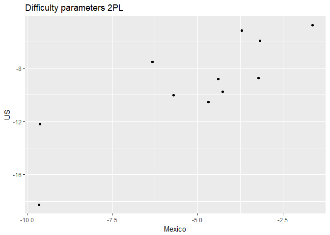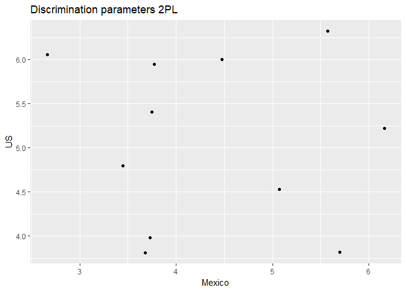

Item Invariance
===============

For this we will analyze at a first stage the proportions of answering affirmatively to each item of the eleven items that are the same in both countries. In order to make comparisons we set the rawscore and then analyze each item proportion for both countries. A second, more formal stage is to perform the differential item functioning (DIF). DIF is defined as a measure of an item that tells to what extent such item is measuring different levels of the trait or ability for subjects of different subgroups.

Proportions conditional on rawscore
-----------------------------------

    ##  [1] "balance"       "skipped"       "ateless"       "runout"       
    ##  [5] "hungry"        "wholeday"      "balancechild"  "enoughchild"  
    ##  [9] "cutsizechild"  "hungrychild"   "wholedaychild" "origrawsc"    
    ## [13] "weight"        "rawscore"

    ##  [1] "balance"       "skipped"       "ateless"       "runout"       
    ##  [5] "hungry"        "wholeday"      "balancechild"  "enoughchild"  
    ##  [9] "cutsizechild"  "hungrychild"   "wholedaychild" "origrawsc"    
    ## [13] "weight"        "rawscore"

    ##       balance       skipped       ateless        runout        hungry 
    ##             0             0             0             0             0 
    ##      wholeday  balancechild   enoughchild  cutsizechild   hungrychild 
    ##             0             0             0             0             0 
    ## wholedaychild 
    ##             0 
    ##       balance       skipped       ateless        runout        hungry 
    ##             0             0             0             0             0 
    ##      wholeday  balancechild   enoughchild  cutsizechild   hungrychild 
    ##             0             0             0             0             0 
    ## wholedaychild 
    ##             0 
    ##       balance       skipped       ateless        runout        hungry 
    ##  0.6474341930  0.0180802978  0.1231055570  0.0523796863  0.0404147833 
    ##      wholeday  balancechild   enoughchild  cutsizechild   hungrychild 
    ##  0.0103695826  0.0776389258  0.0090401489  0.0188779580  0.0021270939 
    ## wholedaychild 
    ##  0.0005317735 
    ##       balance       skipped       ateless        runout        hungry 
    ##   0.180015860   0.006608512   0.007137193   0.775839281   0.001057362 
    ##      wholeday  balancechild   enoughchild  cutsizechild   hungrychild 
    ##   0.000000000   0.025905366   0.003436426   0.000000000   0.000000000 
    ## wholedaychild 
    ##   0.000000000 
    ##       balance       skipped       ateless        runout        hungry 
    ##   0.818720749   0.063338534   0.371294852   0.085491420   0.078939158 
    ##      wholeday  balancechild   enoughchild  cutsizechild   hungrychild 
    ##   0.040561622   0.440873635   0.034009360   0.059282371   0.005304212 
    ## wholedaychild 
    ##   0.002184087 
    ##       balance       skipped       ateless        runout        hungry 
    ##   0.686898284   0.098367518   0.137714525   0.822101298   0.018836333 
    ##      wholeday  balancechild   enoughchild  cutsizechild   hungrychild 
    ##   0.005023022   0.184596065   0.035998326   0.008371704   0.002092926 
    ## wholedaychild 
    ##   0.000000000 
    ##       balance       skipped       ateless        runout        hungry 
    ##    0.82930299    0.18492176    0.64864865    0.18444761    0.21005216 
    ##      wholeday  balancechild   enoughchild  cutsizechild   hungrychild 
    ##    0.09767662    0.50213371    0.15742058    0.15789474    0.01517307 
    ## wholedaychild 
    ##    0.01232812 
    ##       balance       skipped       ateless        runout        hungry 
    ##      0.755625      0.325000      0.343125      0.926250      0.072500 
    ##      wholeday  balancechild   enoughchild  cutsizechild   hungrychild 
    ##      0.005625      0.485625      0.056875      0.025000      0.004375 
    ## wholedaychild 
    ##      0.000000 
    ##       balance       skipped       ateless        runout        hungry 
    ##    0.89665127    0.33487298    0.77540416    0.25057737    0.30946882 
    ##      wholeday  balancechild   enoughchild  cutsizechild   hungrychild 
    ##    0.15184758    0.57852194    0.34411085    0.31062356    0.03637413 
    ## wholedaychild 
    ##    0.01154734 
    ##       balance       skipped       ateless        runout        hungry 
    ##    0.83757178    0.59392945    0.66037736    0.95077933    0.16078753 
    ##      wholeday  balancechild   enoughchild  cutsizechild   hungrychild 
    ##    0.02050861    0.52830189    0.20508614    0.02953240    0.01312551 
    ## wholedaychild 
    ##    0.00000000 
    ##       balance       skipped       ateless        runout        hungry 
    ##    0.93561974    0.40854392    0.87725632    0.29061372    0.42298436 
    ##      wholeday  balancechild   enoughchild  cutsizechild   hungrychild 
    ##    0.25030084    0.68351384    0.53429603    0.51143201    0.05655836 
    ## wholedaychild 
    ##    0.02888087 
    ##       balance       skipped       ateless        runout        hungry 
    ##    0.90862944    0.81624365    0.89035533    0.98375635    0.43451777 
    ##      wholeday  balancechild   enoughchild  cutsizechild   hungrychild 
    ##    0.07411168    0.59796954    0.21116751    0.07005076    0.01319797 
    ## wholedaychild 
    ##    0.00000000 
    ##       balance       skipped       ateless        runout        hungry 
    ##    0.94155844    0.60173160    0.92063492    0.48629149    0.63708514 
    ##      wholeday  balancechild   enoughchild  cutsizechild   hungrychild 
    ##    0.44877345    0.68398268    0.55627706    0.55194805    0.11471861 
    ## wholedaychild 
    ##    0.05699856 
    ##       balance       skipped       ateless        runout        hungry 
    ##   0.975539568   0.922302158   0.923741007   0.992805755   0.635971223 
    ##      wholeday  balancechild   enoughchild  cutsizechild   hungrychild 
    ##   0.233093525   0.768345324   0.356834532   0.125179856   0.063309353 
    ## wholedaychild 
    ##   0.002877698 
    ##       balance       skipped       ateless        runout        hungry 
    ##     0.9480392     0.6686275     0.9441176     0.4843137     0.7058824 
    ##      wholeday  balancechild   enoughchild  cutsizechild   hungrychild 
    ##     0.4715686     0.8950980     0.7833333     0.7549020     0.2303922 
    ## wholedaychild 
    ##     0.1137255 
    ##       balance       skipped       ateless        runout        hungry 
    ##    0.98321343    0.98800959    0.97362110    0.97362110    0.75539568 
    ##      wholeday  balancechild   enoughchild  cutsizechild   hungrychild 
    ##    0.30455635    0.98800959    0.66666667    0.27338129    0.09352518 
    ## wholedaychild 
    ##    0.00000000 
    ##       balance       skipped       ateless        runout        hungry 
    ##     0.9620253     0.8181818     0.9689298     0.5776755     0.8423475 
    ##      wholeday  balancechild   enoughchild  cutsizechild   hungrychild 
    ##     0.5765247     0.9355581     0.9113924     0.8469505     0.3659379 
    ## wholedaychild 
    ##     0.1944764 
    ##       balance       skipped       ateless        runout        hungry 
    ##     0.9342561     0.9757785     0.9757785     1.0000000     0.9204152 
    ##      wholeday  balancechild   enoughchild  cutsizechild   hungrychild 
    ##     0.5017301     0.9480969     0.8581315     0.5743945     0.3114187 
    ## wholedaychild 
    ##     0.0000000 
    ##       balance       skipped       ateless        runout        hungry 
    ##     0.9748201     0.8992806     0.9796163     0.7422062     0.9148681 
    ##      wholeday  balancechild   enoughchild  cutsizechild   hungrychild 
    ##     0.7577938     0.9784173     0.9580336     0.9556355     0.5431655 
    ## wholedaychild 
    ##     0.2961631 
    ##       balance       skipped       ateless        runout        hungry 
    ##    1.00000000    0.97350993    0.98675497    1.00000000    0.92715232 
    ##      wholeday  balancechild   enoughchild  cutsizechild   hungrychild 
    ##    0.57615894    1.00000000    0.97350993    0.75496689    0.78145695 
    ## wholedaychild 
    ##    0.02649007 
    ##       balance       skipped       ateless        runout        hungry 
    ##     0.9862805     0.9573171     0.9939024     0.7591463     0.9695122 
    ##      wholeday  balancechild   enoughchild  cutsizechild   hungrychild 
    ##     0.8887195     0.9817073     0.9939024     0.9771341     0.8841463 
    ## wholedaychild 
    ##     0.6082317 
    ##       balance       skipped       ateless        runout        hungry 
    ##     1.0000000     0.9734513     0.9823009     1.0000000     1.0000000 
    ##      wholeday  balancechild   enoughchild  cutsizechild   hungrychild 
    ##     0.9203540     1.0000000     1.0000000     0.9734513     1.0000000 
    ## wholedaychild 
    ##     0.1504425 
    ##       balance       skipped       ateless        runout        hungry 
    ##             1             1             1             1             1 
    ##      wholeday  balancechild   enoughchild  cutsizechild   hungrychild 
    ##             1             1             1             1             1 
    ## wholedaychild 
    ##             1 
    ##       balance       skipped       ateless        runout        hungry 
    ##             1             1             1             1             1 
    ##      wholeday  balancechild   enoughchild  cutsizechild   hungrychild 
    ##             1             1             1             1             1 
    ## wholedaychild 
    ##             1

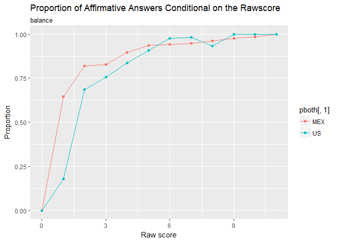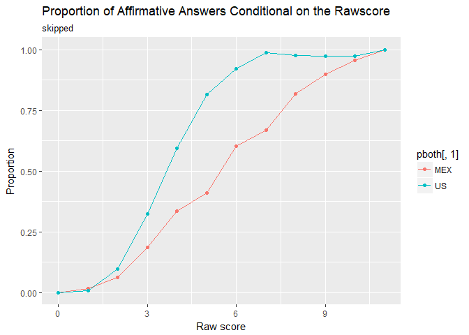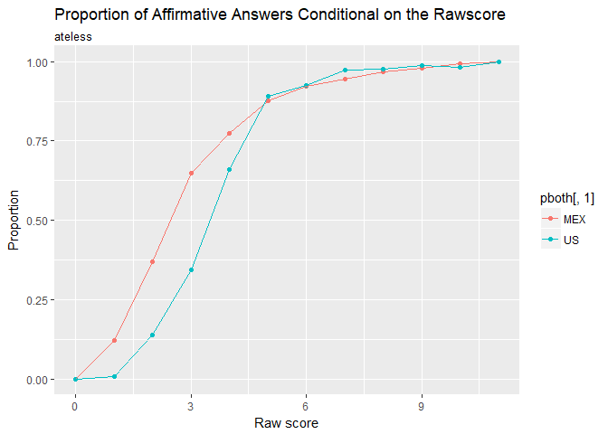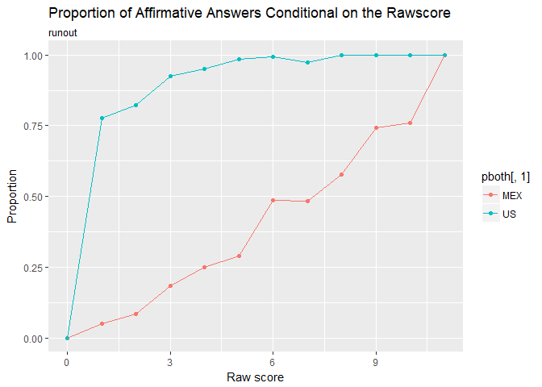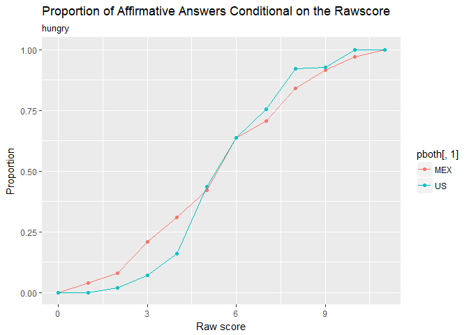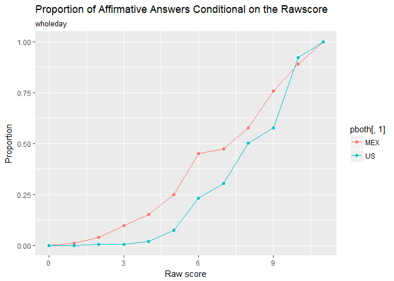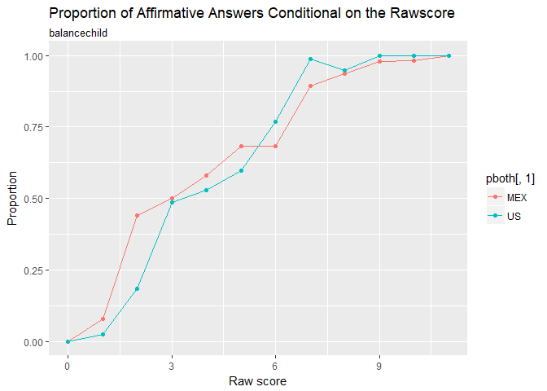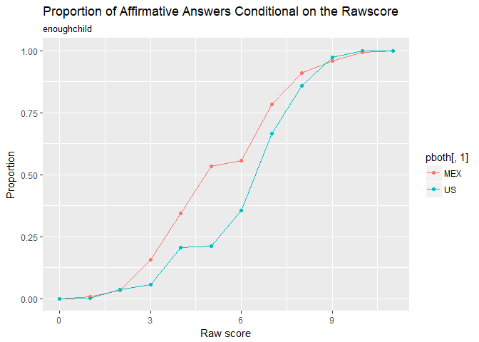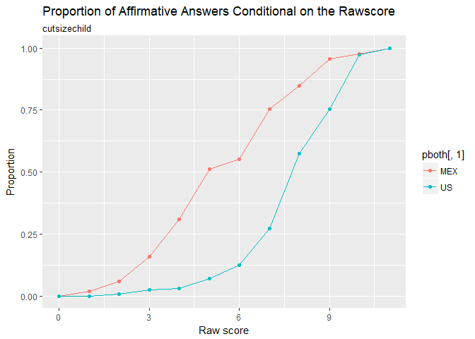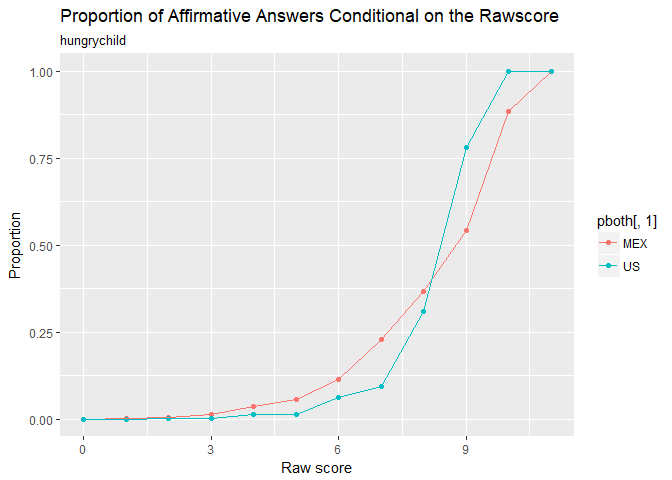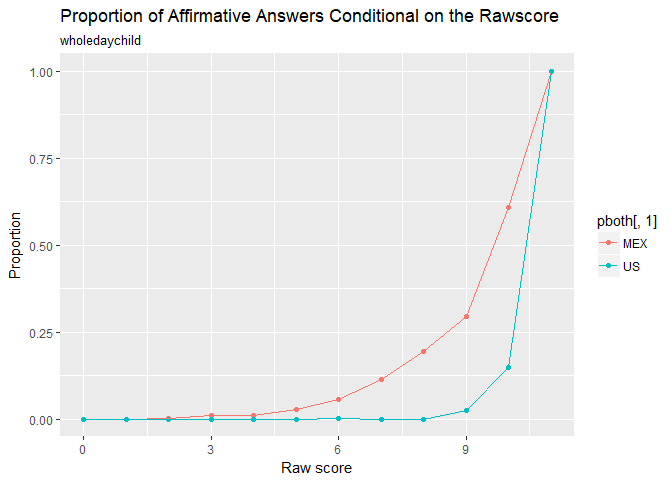

DIF analysis
------------

The next analysis shows that all 11 items have DIF. The graph summarizes the results of testing whether adding slopes and intercepts constraints results in DIF. Plotted items are the items that show DIF, we can see that all 11 items are shown in the graph, the graph shows the trace line for every item and for each country.

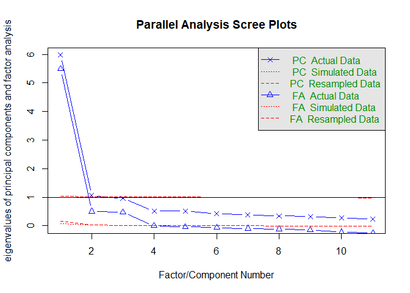

    ## Parallel analysis suggests that the number of factors =  3  and the number of components =  2

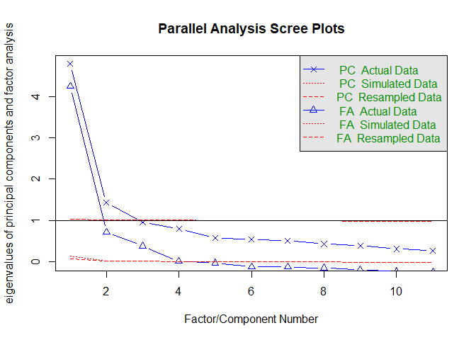

    ## Parallel analysis suggests that the number of factors =  3  and the number of components =  2

    ## 
    Iteration: 1, Log-Lik: -260637.276, Max-Change: 3.91672
    Iteration: 2, Log-Lik: -219537.451, Max-Change: 2.32012
    Iteration: 3, Log-Lik: -205818.738, Max-Change: 1.11359
    Iteration: 4, Log-Lik: -200784.294, Max-Change: 0.76545
    Iteration: 5, Log-Lik: -198552.797, Max-Change: 0.37899
    Iteration: 6, Log-Lik: -197197.924, Max-Change: 0.34941
    Iteration: 7, Log-Lik: -196214.482, Max-Change: 0.32256
    Iteration: 8, Log-Lik: -195532.020, Max-Change: 0.29995
    Iteration: 9, Log-Lik: -195051.447, Max-Change: 0.30230
    Iteration: 10, Log-Lik: -194670.691, Max-Change: 0.32485
    Iteration: 11, Log-Lik: -194352.812, Max-Change: 0.37161
    Iteration: 12, Log-Lik: -194078.954, Max-Change: 0.69479
    Iteration: 13, Log-Lik: -193823.520, Max-Change: 0.87125
    Iteration: 14, Log-Lik: -193552.248, Max-Change: 0.18064
    Iteration: 15, Log-Lik: -193330.753, Max-Change: 0.43679
    Iteration: 16, Log-Lik: -193107.575, Max-Change: 0.15946
    Iteration: 17, Log-Lik: -192925.173, Max-Change: 0.68810
    Iteration: 18, Log-Lik: -192732.476, Max-Change: 0.17444
    Iteration: 19, Log-Lik: -192599.946, Max-Change: 0.36317
    Iteration: 20, Log-Lik: -192458.645, Max-Change: 0.16674
    Iteration: 21, Log-Lik: -192349.750, Max-Change: 0.19324
    Iteration: 22, Log-Lik: -192242.422, Max-Change: 0.21439
    Iteration: 23, Log-Lik: -192148.570, Max-Change: 0.08939
    Iteration: 24, Log-Lik: -192071.473, Max-Change: 0.35244
    Iteration: 25, Log-Lik: -191984.006, Max-Change: 0.14913
    Iteration: 26, Log-Lik: -191925.063, Max-Change: 0.11894
    Iteration: 27, Log-Lik: -191863.015, Max-Change: 0.13105
    Iteration: 28, Log-Lik: -191806.611, Max-Change: 0.12929
    Iteration: 29, Log-Lik: -191760.831, Max-Change: 0.23463
    Iteration: 30, Log-Lik: -191708.809, Max-Change: 0.25743
    Iteration: 31, Log-Lik: -191584.467, Max-Change: 0.10711
    Iteration: 32, Log-Lik: -191506.726, Max-Change: 0.16731
    Iteration: 33, Log-Lik: -191446.111, Max-Change: 0.14116
    Iteration: 34, Log-Lik: -191395.423, Max-Change: 0.11989
    Iteration: 35, Log-Lik: -191356.859, Max-Change: 0.04194
    Iteration: 36, Log-Lik: -191341.677, Max-Change: 0.07463
    Iteration: 37, Log-Lik: -191313.646, Max-Change: 0.07445
    Iteration: 38, Log-Lik: -191289.389, Max-Change: 0.01996
    Iteration: 39, Log-Lik: -191275.594, Max-Change: 0.06706
    Iteration: 40, Log-Lik: -191259.301, Max-Change: 0.04961
    Iteration: 41, Log-Lik: -191245.498, Max-Change: 0.03930
    Iteration: 42, Log-Lik: -191234.441, Max-Change: 0.01327
    Iteration: 43, Log-Lik: -191227.806, Max-Change: 0.01996
    Iteration: 44, Log-Lik: -191223.745, Max-Change: 0.01075
    Iteration: 45, Log-Lik: -191218.753, Max-Change: 0.00954
    Iteration: 46, Log-Lik: -191214.370, Max-Change: 0.00881
    Iteration: 47, Log-Lik: -191210.506, Max-Change: 0.00821
    Iteration: 48, Log-Lik: -191207.096, Max-Change: 0.00809
    Iteration: 49, Log-Lik: -191191.891, Max-Change: 0.00576
    Iteration: 50, Log-Lik: -191190.607, Max-Change: 0.00666
    Iteration: 51, Log-Lik: -191189.486, Max-Change: 0.00673
    Iteration: 52, Log-Lik: -191184.461, Max-Change: 0.00510
    Iteration: 53, Log-Lik: -191184.015, Max-Change: 0.00292
    Iteration: 54, Log-Lik: -191183.641, Max-Change: 0.00311
    Iteration: 55, Log-Lik: -191182.442, Max-Change: 0.00323
    Iteration: 56, Log-Lik: -191182.272, Max-Change: 0.00298
    Iteration: 57, Log-Lik: -191182.122, Max-Change: 0.00287
    Iteration: 58, Log-Lik: -191181.432, Max-Change: 0.00206
    Iteration: 59, Log-Lik: -191181.390, Max-Change: 0.00147
    Iteration: 60, Log-Lik: -191181.347, Max-Change: 0.00165
    Iteration: 61, Log-Lik: -191181.292, Max-Change: 0.00172
    Iteration: 62, Log-Lik: -191181.229, Max-Change: 0.00129
    Iteration: 63, Log-Lik: -191181.201, Max-Change: 0.00096
    Iteration: 64, Log-Lik: -191181.142, Max-Change: 0.00347
    Iteration: 65, Log-Lik: -191181.114, Max-Change: 0.00138
    Iteration: 66, Log-Lik: -191181.078, Max-Change: 0.00110
    Iteration: 67, Log-Lik: -191181.055, Max-Change: 0.00110
    Iteration: 68, Log-Lik: -191181.035, Max-Change: 0.00105
    Iteration: 69, Log-Lik: -191181.019, Max-Change: 0.00085
    Iteration: 70, Log-Lik: -191180.993, Max-Change: 0.00077
    Iteration: 71, Log-Lik: -191180.983, Max-Change: 0.00077
    Iteration: 72, Log-Lik: -191180.975, Max-Change: 0.00075
    Iteration: 73, Log-Lik: -191180.942, Max-Change: 0.00283
    Iteration: 74, Log-Lik: -191180.933, Max-Change: 0.00111
    Iteration: 75, Log-Lik: -191180.924, Max-Change: 0.00064
    Iteration: 76, Log-Lik: -191180.920, Max-Change: 0.00042
    Iteration: 77, Log-Lik: -191180.914, Max-Change: 0.00041
    Iteration: 78, Log-Lik: -191180.909, Max-Change: 0.00035
    Iteration: 79, Log-Lik: -191180.898, Max-Change: 0.00041
    Iteration: 80, Log-Lik: -191180.896, Max-Change: 0.00031
    Iteration: 81, Log-Lik: -191180.894, Max-Change: 0.00033
    Iteration: 82, Log-Lik: -191180.892, Max-Change: 0.00029
    Iteration: 83, Log-Lik: -191180.890, Max-Change: 0.00028
    Iteration: 84, Log-Lik: -191180.889, Max-Change: 0.00027
    Iteration: 85, Log-Lik: -191180.888, Max-Change: 0.00029
    Iteration: 86, Log-Lik: -191180.887, Max-Change: 0.00025
    Iteration: 87, Log-Lik: -191180.886, Max-Change: 0.00024
    Iteration: 88, Log-Lik: -191180.885, Max-Change: 0.00024
    Iteration: 89, Log-Lik: -191180.884, Max-Change: 0.00022
    Iteration: 90, Log-Lik: -191180.884, Max-Change: 0.00023
    Iteration: 91, Log-Lik: -191180.883, Max-Change: 0.00021
    Iteration: 92, Log-Lik: -191180.882, Max-Change: 0.00022
    Iteration: 93, Log-Lik: -191180.882, Max-Change: 0.00020
    Iteration: 94, Log-Lik: -191180.881, Max-Change: 0.00021
    Iteration: 95, Log-Lik: -191180.881, Max-Change: 0.00020
    Iteration: 96, Log-Lik: -191180.881, Max-Change: 0.00020
    Iteration: 97, Log-Lik: -191180.880, Max-Change: 0.00019
    Iteration: 98, Log-Lik: -191180.880, Max-Change: 0.00019
    Iteration: 99, Log-Lik: -191180.880, Max-Change: 0.00018
    Iteration: 100, Log-Lik: -191180.879, Max-Change: 0.00019
    Iteration: 101, Log-Lik: -191180.879, Max-Change: 0.00018
    Iteration: 102, Log-Lik: -191180.879, Max-Change: 0.00018
    Iteration: 103, Log-Lik: -191180.878, Max-Change: 0.00017
    Iteration: 104, Log-Lik: -191180.878, Max-Change: 0.00017
    Iteration: 105, Log-Lik: -191180.878, Max-Change: 0.00017
    Iteration: 106, Log-Lik: -191180.878, Max-Change: 0.00017
    Iteration: 107, Log-Lik: -191180.877, Max-Change: 0.00016
    Iteration: 108, Log-Lik: -191180.877, Max-Change: 0.00083
    Iteration: 109, Log-Lik: -191180.877, Max-Change: 0.00069
    Iteration: 110, Log-Lik: -191180.876, Max-Change: 0.00058
    Iteration: 111, Log-Lik: -191180.876, Max-Change: 0.00048
    Iteration: 112, Log-Lik: -191180.875, Max-Change: 0.00075
    Iteration: 113, Log-Lik: -191180.875, Max-Change: 0.00043
    Iteration: 114, Log-Lik: -191180.874, Max-Change: 0.00035
    Iteration: 115, Log-Lik: -191180.874, Max-Change: 0.00356
    Iteration: 116, Log-Lik: -191180.872, Max-Change: 0.00115
    Iteration: 117, Log-Lik: -191180.872, Max-Change: 0.00096
    Iteration: 118, Log-Lik: -191180.870, Max-Change: 0.00014
    Iteration: 119, Log-Lik: -191180.870, Max-Change: 0.00013
    Iteration: 120, Log-Lik: -191180.870, Max-Change: 0.00011
    Iteration: 121, Log-Lik: -191180.870, Max-Change: 0.00059
    Iteration: 122, Log-Lik: -191180.869, Max-Change: 0.00037
    Iteration: 123, Log-Lik: -191180.869, Max-Change: 0.00032
    Iteration: 124, Log-Lik: -191180.869, Max-Change: 0.00283
    Iteration: 125, Log-Lik: -191180.868, Max-Change: 0.00119
    Iteration: 126, Log-Lik: -191180.868, Max-Change: 0.00100
    Iteration: 127, Log-Lik: -191180.866, Max-Change: 0.00016
    Iteration: 128, Log-Lik: -191180.866, Max-Change: 0.00013
    Iteration: 129, Log-Lik: -191180.866, Max-Change: 0.00011
    Iteration: 130, Log-Lik: -191180.866, Max-Change: 0.00047
    Iteration: 131, Log-Lik: -191180.865, Max-Change: 0.00023
    Iteration: 132, Log-Lik: -191180.865, Max-Change: 0.00019
    Iteration: 133, Log-Lik: -191180.865, Max-Change: 0.01142
    Iteration: 134, Log-Lik: -191180.858, Max-Change: 0.00055
    Iteration: 135, Log-Lik: -191180.858, Max-Change: 0.00046
    Iteration: 136, Log-Lik: -191180.858, Max-Change: 0.00007
    ## 
    ## Calculating information matrix...

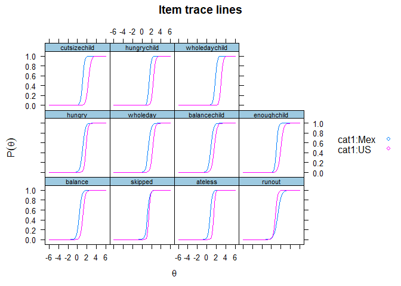

    ## $balance
    ##        AIC     AICc    SABIC      BIC    logLik       X2  df   p
    ## 1 388063.6 388063.7 388325.7 388459.1 -193989.8      NaN NaN NaN
    ## 2 382449.7 382449.8 382724.2 382864.1 -191180.9 5617.917   2   0
    ## 
    ## $skipped
    ##        AIC     AICc    SABIC      BIC    logLik       X2  df   p
    ## 1 384034.1 384034.1 384296.1 384429.6 -191975.0      NaN NaN NaN
    ## 2 382449.7 382449.8 382724.2 382864.1 -191180.9 1588.345   2   0
    ## 
    ## $ateless
    ##        AIC     AICc    SABIC      BIC    logLik       X2  df   p
    ## 1 387794.8 387794.8 388056.8 388190.3 -193855.4      NaN NaN NaN
    ## 2 382449.7 382449.8 382724.2 382864.1 -191180.9 5349.073   2   0
    ## 
    ## $runout
    ##        AIC     AICc    SABIC      BIC    logLik       X2  df   p
    ## 1 383904.9 383905.0 384166.9 384300.4 -191910.5      NaN NaN NaN
    ## 2 382449.7 382449.8 382724.2 382864.1 -191180.9 1459.201   2   0
    ## 
    ## $hungry
    ##        AIC     AICc    SABIC      BIC    logLik       X2  df   p
    ## 1 386201.8 386201.8 386463.8 386597.3 -193058.9      NaN NaN NaN
    ## 2 382449.7 382449.8 382724.2 382864.1 -191180.9 3756.045   2   0
    ## 
    ## $wholeday
    ##        AIC     AICc    SABIC      BIC    logLik   X2  df   p
    ## 1 386445.7 386445.8 386707.7 386841.2 -193180.9  NaN NaN NaN
    ## 2 382449.7 382449.8 382724.2 382864.1 -191180.9 4000   2   0
    ## 
    ## $balancechild
    ##        AIC     AICc    SABIC      BIC    logLik       X2  df   p
    ## 1 386316.7 386316.7 386578.7 386712.2 -193116.3      NaN NaN NaN
    ## 2 382449.7 382449.8 382724.2 382864.1 -191180.9 3870.979   2   0
    ## 
    ## $enoughchild
    ##        AIC     AICc    SABIC      BIC    logLik       X2  df   p
    ## 1 386501.3 386501.4 386763.4 386896.8 -193208.7      NaN NaN NaN
    ## 2 382449.7 382449.8 382724.2 382864.1 -191180.9 4055.621   2   0
    ## 
    ## $cutsizechild
    ##        AIC     AICc    SABIC      BIC    logLik       X2  df   p
    ## 1 388598.2 388598.2 388860.2 388993.7 -194257.1      NaN NaN NaN
    ## 2 382449.7 382449.8 382724.2 382864.1 -191180.9 6152.485   2   0
    ## 
    ## $hungrychild
    ##        AIC     AICc    SABIC      BIC    logLik       X2  df   p
    ## 1 384749.3 384749.4 385011.3 385144.8 -192332.7      NaN NaN NaN
    ## 2 382449.7 382449.8 382724.2 382864.1 -191180.9 2303.603   2   0
    ## 
    ## $wholedaychild
    ##        AIC     AICc    SABIC      BIC    logLik      X2  df   p
    ## 1 385118.4 385118.5 385380.5 385513.9 -192517.2     NaN NaN NaN
    ## 2 382449.7 382449.8 382724.2 382864.1 -191180.9 2672.71   2   0

    ## $balance
    ##          W df p
    ## 1 3772.378  2 0
    ## 
    ## $skipped
    ##          W df p
    ## 1 876.3885  2 0
    ## 
    ## $ateless
    ##          W df p
    ## 1 2507.777  2 0
    ## 
    ## $runout
    ##          W df p
    ## 1 1149.865  2 0
    ## 
    ## $hungry
    ##          W df p
    ## 1 1935.257  2 0
    ## 
    ## $wholeday
    ##          W df p
    ## 1 2041.319  2 0
    ## 
    ## $balancechild
    ##         W df p
    ## 1 2923.81  2 0
    ## 
    ## $enoughchild
    ##          W df p
    ## 1 2636.478  2 0
    ## 
    ## $cutsizechild
    ##          W df p
    ## 1 3158.246  2 0
    ## 
    ## $hungrychild
    ##          W df p
    ## 1 1269.366  2 0
    ## 
    ## $wholedaychild
    ##          W df p
    ## 1 691.9577  2 0
    ## 
    ## $adj_pvals
    ##       balance       skipped       ateless        runout        hungry 
    ##             0             0             0             0             0 
    ##      wholeday  balancechild   enoughchild  cutsizechild   hungrychild 
    ##             0             0             0             0             0 
    ## wholedaychild 
    ##             0

    ##       balance       skipped       ateless        runout        hungry 
    ##             0             0             0             0             0 
    ##      wholeday  balancechild   enoughchild  cutsizechild   hungrychild 
    ##             0             0             0             0             0 
    ## wholedaychild 
    ##             0

To do´s:
--------

1.  Interpretation of the DIF analysis

2.  Anchor is the same as equating?

3.  Parameters for DIF analysis change, is that ok, we are using the parameters for the whole model (complete scales) first and then for DIF just the 11 comparable items

4.  How do I get the equivalent factor score for each status, i.e. if a household has a status of high food security, how do I know the equivalent scores in the trait?
